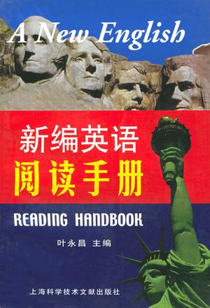

# 新编英语阅读手册

### 叶永昌 主编

## 内容提要

本书开门见山，以英语关联词和常用词为引子，综合地讨论它们多种语法功能和搭配用法，使读者通过大量实例扎实地理解和掌握。

对于过去大多数只能死记硬背的“动词+副词或介词+……”的短语改为按英语思维形象化地去理解。这种“英语形象联想教学法”及有关内容荣获天津市优秀教学成果二、三等奖。书中均以动词短语中的介词或副词为引子，通过细致分类汇总了它们和有关动词搭配时的动词短语用法。例如，书中仅副词out的功能性用法分类就有10多种，并且各有许多举例汇总，于是形成形象和联想，语感油然而生。

本书还将编者荣获天津市优秀科研成果三等奖的“英语前置定语的新发展一一夹带介词短语的名词性词组作前置定语”介绍给读者，使读者开阔思路。

本书可供大学、中学师生阅读英语材料和学习英语时参考；也可供大学生参加四、六级英语考试，参加研究生入学考试或托福考试前参考学习；还可供广大英语爱好者自学参考。

##前言

本书是在作者原著《科技英语阅读手册》基础上增删编纂的。作者原著《科技英语阅读手册》印数高达130万册，深受读者欢迎。本书定名为《新编英语阅读手册》，一定程度上保留了作者原著特色，但更重要的是增加了作者近年来在全国各地所做的200多场学术讲座中的精彩内容。本书突出了下列几点：

### （一）

对于英语口语中较为常用的“动词+副词或介词（如 about，at，in，on，off，out，over，up 等）”短语动词，全部按其搭配用法和特定的分类含义分门别类集中举例列出，并将过去一般只能死记硬背的固定短语改为按英语思维形象化地去理解。这种“英语形象联想教学法”及有关内容荣获天津市优秀教学成果二、三等奖。例如在“out 的搭配用法和理解”专题内，集中列出 beat out the fire（扑灭或打灭火），blow out the candle（吹灭蜡烛），crush the cigarette（掐灭香烟），stamp the fire（跺灭火），turn out（或off）the light（熄灯、旋灭灯或关灯）等许多个短语动词，使读者明白，副词 out 表示各种方式“灭火”中的“灭”，于是对于The fire was out [“火灭”的静态] 及 The fire went out [“火灭”的动态] 便迎刃而解。本书对于上述功能性的副词或介词，都按其各种功能性用法分类举例汇总。例如“各种穿戴”多数用 on。有时用 into 或 in；各种脱衣一般用 off。但 on 还可表示“继续下去”之意，便又单开一个分类，将 go on（走下去，进行下去），drive on（继续开车），read on（读下去），say on（说下去），work on（继续工作下去），write on（写下去）等几十个类似用法列为一类。on 或 off 的其它 10 多种功能性用法也都是以举例汇总形式集中介绍，于是形成“联想”，语感油然而生。作者已在全国 20 多个省市举办学术讲座 200 多次，以推广这种提高英语语感颇为有效的教学方法。有位南昌大学的学生在致作者的贺年卡上写道：“……我正在读您的书，多处有‘茅塞顿开，猛然醒悟’的感觉，特此向您表示感谢。”另有一名湖南师范大学的学生在听完讲座后立即上讲台请求和作者拥抱，接着又请求第二次拥抱，台下众多学生热烈鼓掌，场面令人难忘。

### （二）

将作者荣获天津市优秀科研成果三等奖的“名词作前置定语的新发展——夹带介词短语的名词性词组作前置定语”有关内容编入书中，向读者展示理解英语搭配的新思路。例如 Clinton State of Union Address（克林顿的国情演讲），Right to Life Rally（维护生存权的集会）等。

### （三）
语法讲解一般用句型、结构或常用关联词的搭配用法等来介绍，以便达到“开门见山，简明易懂”的效果。举例尽量用浅易的词汇，并尽可能体现新时代特色。例如，在用例中出现：信息技术产业、第三产业、电子商务、数字高清晰度电视、多媒体电脑、笔记本电脑、掌上电脑、光电脑、因特网、网上聊天、网上购物或交易、访问网站、网民、网吧、电子邮件、语音邮件、软件开发公司、移动电话（或手机）、寻呼机、可视电话、航天飞机、载人宇宙飞船、试管婴儿、经济型轿车、知识经济、网络经济、克隆技术、WTO（世贸组织）、GDP（国内生产总值）、电视电话会议、计算机病毒、自由贸易区、出口加工区、经济特区、中关村科技园区、高架路、立交桥、内（或外）环路、信息高速公路、上海南京路第一商业步行街、东方明珠电视塔、计算机病毒、中华世纪坛、星级饭店、世界财富论坛、服装展览、房地产市场、开发大西北、科教兴国、家庭服务公司等。

### （四）
目录分为按中心词即关联词和常用词的英语字母顺序的目录以及传统的英语语法目录，以便读者能方便迅速地查到所需的参考内容。

本书由天津大学外语系叶永昌教授主编。参加部分编写工作的有：（按姓氏笔划为序）毛继光、丛理、田文娟、叶爱华、叶盛、刘文彬、刘茜红、向荣、吴茜、李宝毅、忻晓燕、姜洪、顾礼芬、姚家庆、张纹祯、张廉明、逯荣、陶钢、黄嬿、曹青、崔春利等。

本手册可供大学、中学学生学习英语时参考；也可供高中生考大学，大学生考四、六级英语或参加研究生入学英语考试或托福考试前参考学习。本书还可供广大的英语爱好者自学时参考。

本书在编写中，缺点错误在所难免，希望广大读者批评指正，以便进一步修改。
